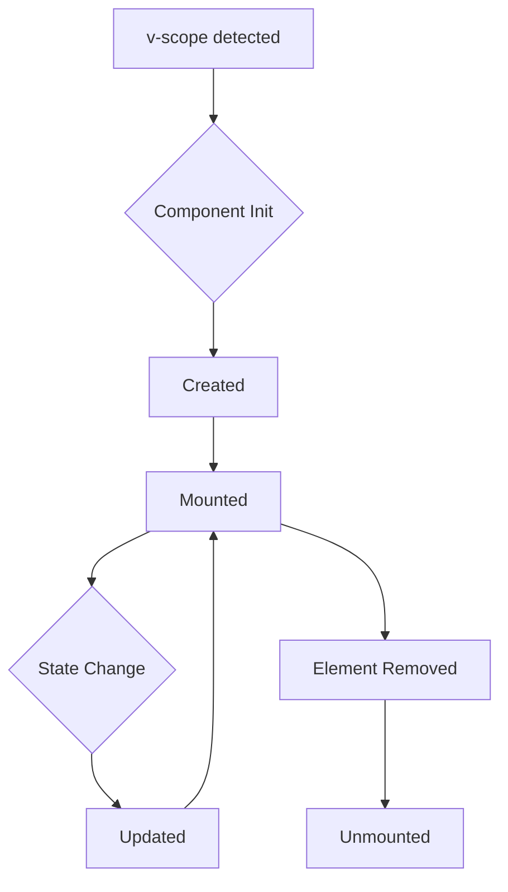

# Lifecycle Events

pico-vue provides special lifecycle events that you can listen to on any element.

## Available Events

- `@vue:mounted`: Fired when the element is mounted and directives are initialized.
- `@vue:unmounted`: Fired when the element is unmounted (e.g., via `v-if`).

## Usage

```html
<div
  v-if="show"
  @vue:mounted="console.log('mounted on: ', $el)"
  @vue:unmounted="console.log('unmounted: ', $el)"
>
  I am visible
</div>
```

## Practical Use Cases

### Auto-focus Input

```html
<input @vue:mounted="$el.focus()">
```

### Integrating 3rd Party Libraries

You can use `@vue:mounted` to initialize jQuery plugins or other libraries on the element.

```html
<div @vue:mounted="new Pikaday({ field: $el })">
  <input type="text">
</div>
```

### Cleanup

Use `@vue:unmounted` to clean up event listeners or timers to prevent memory leaks.

## Lifecycle Diagram

Here is a visualization of the component lifecycle:



> [!NOTE]
> `v-effect` watchers are automatically disposed of when the component is unmounted.


